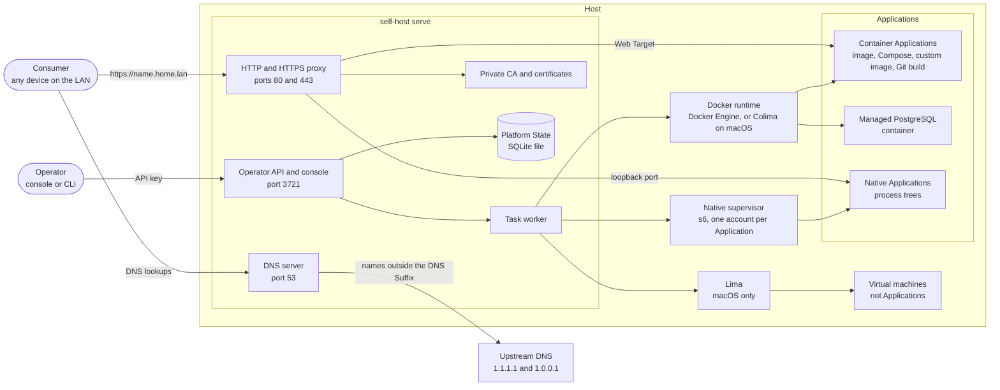

# self-host

self-host runs on one machine on your LAN, called the Host. It gives each
Application its own name, such as `https://blog.home.lan`, serves DNS and HTTPS
for those names, and issues the certificates your devices trust. Nothing
outside the Host is needed for that local setup.

## What the Platform does

- **Applications.** Deploy a container image, a Compose file, a local build
  path, or a Git repository. Each Application answers at its own
  `https://<name>.home.lan`. A native Application runs as a process tree under
  its own account, with no container.
- **Databases.** Managed PostgreSQL 16, 17 and 18 runs as a private container.
  For each connection, the Platform creates a database and a login, and stores
  the connection in a variable the Application reads, usually `DATABASE_URL`.
- **Custom images.** An image recipe carries its own Dockerfile. Setup commands
  run during the build, and you can edit the generated Dockerfile by hand
  ([ADR-0022](docs/adr/0022-custom-images-hand-over-their-dockerfile.md)).
- **DNS records.** The console shows and edits the zone. A name points where its
  record says, and a record can move
  ([ADR-0025](docs/adr/0025-names-are-records-and-a-machine-joins-the-lan.md),
  [ADR-0026](docs/adr/0026-a-machine-is-its-record-a-record-can-move-and-a-name-is-a-label.md)).
- **Routes.** The Routes page lists each hostname and path the proxy answers.
  A change applies at once, without a rebuild or restart.
- **Certificates.** A private CA issues a wildcard certificate for the DNS
  Suffix. Public ACME certificates are optional, one per configured name
  ([public certificates](docs/public-certificates.md)).
- **Virtual machines (macOS).** A persistent Ubuntu workspace with its own name
  and address on the LAN. It is not an Application
  ([ADR-0023](docs/adr/0023-virtual-machines-run-on-apple-virtualization.md)).
- **Event history.** The console keeps a history of platform events and audit
  records.

## How it fits together

You run one daemon, `self-host serve`. It owns the DNS server, the proxy, the
certificates and the state. For each Application it starts the runtime that
fits: Docker for container Applications and managed databases, a supervisor for
native Applications, and Lima for virtual machines on macOS.



## Features by operating system

| Feature | Linux | macOS |
| --- | --- | --- |
| Container Applications (image, Compose, local build) | Yes, with Docker | Yes. The installer sets up Colima unless Docker already runs |
| Git repository and custom image builds | Yes, with Docker | Yes, with Docker |
| Managed PostgreSQL | Yes | Yes |
| Native Applications | Yes, after the native supervisor is installed | MVP, through a restricted helper |
| Resource limits, metrics and terminal for native Applications | Yes | No |
| Managed PostgreSQL connections for native Applications | Yes | No |
| Virtual machines | No | Yes, on Apple Silicon with macOS 13 or later |
| DNS server and Zone | Yes. `setup-dns` configures systemd-resolved, other resolvers need manual setup | Yes. `setup-dns` writes `/etc/resolver` |
| HTTP and HTTPS proxy, local CA | Yes | Yes |
| Public certificates (ACME) | Yes, needs public DNS and inbound port 80 | Yes, needs public DNS and inbound port 80 |
| Platform starts at boot | Not set up by the installer. Add a systemd unit yourself | Yes. The installer installs LaunchDaemons, so no login is needed |

- Native Applications on macOS are an MVP. The
  [validation record](docs/macos-native-applications.md) lists the checks and
  release gates.
- Linux native Applications need cgroup v2 with the cpu, memory and pids
  controllers.
- Virtual machines run only on macOS. The Lima template asks for Apple
  Virtualization (`vmType: vz`), and only macOS provides it.

## Install

### macOS

```bash
curl -fsSL https://raw.githubusercontent.com/momoi-labs/self-host/main/install.sh | bash
```

The installer puts the binary in place. It sets up Colima for Docker unless a
Docker runtime already answers `docker info`. It also configures the DNS
resolver and the CA, and installs the LaunchDaemons. The installer resolves
`latest`. To pin a version, pass it after `bash -s --`.

You need Homebrew unless Docker already runs, and the Xcode Command Line Tools
to build `socket_vmnet`. The prerequisites and the Host record are in
[docs/macos-host.md](docs/macos-host.md).

Do not use the Homebrew cask for a Host. It installs the binary only, so the
Host gets no native supervision and no launch at boot. The cask is tracked in
[#169](https://github.com/momoi-labs/self-host/issues/169).

### Linux

Download the package for your distribution and architecture, plus
`checksums.txt`, from [GitHub Releases](https://github.com/momoi-labs/self-host/releases).
Verify it with `sha256sum --check --ignore-missing checksums.txt`, then install:

```bash
sudo pacman -U ./self-host-bin-<version>-1-<arch>.pkg.tar.zst # Arch / Omarchy
sudo apt install ./self-host-bin_<version>_<arch>.deb       # Debian / Ubuntu
sudo dnf install ./self-host-bin-<version>-1.<arch>.rpm      # Fedora
```

Install a newer release's file the same way to upgrade. Remove it with
`sudo pacman -R self-host-bin`, `sudo apt remove self-host-bin`, or
`sudo dnf remove self-host-bin`. AUR publication is disabled.

Packages keep Platform State and install the binary and the s6 tools. They do
not configure Docker, DNS, daemon startup or native supervision. After each
install or upgrade, grant the binary the bind privilege with
`sudo setcap cap_net_bind_service=+ep /usr/bin/self-host`, or use the systemd
setting described under [DNS](#dns).

Native Applications on Linux need the `self-host-native.service` unit. The
script installer creates it when you run it with `SELF_HOST_NATIVE=1`.
Packages do not. See [docs/native-applications.md](docs/native-applications.md).

Supported platforms: macOS (Intel and Apple Silicon) and Linux (amd64 and
arm64).

## Quick start

On Linux, or with the script installer and `SELF_HOST_BINARY_ONLY=1`:

```bash
self-host init
self-host serve # keep running; use another terminal for the next command
self-host setup-dns # Linux with systemd-resolved; the macOS installer does this
```

Then open `https://admin.<your-dns-suffix>`, which is `https://admin.home.lan`
by default.

`init` generates a random API key and saves it for the console and the CLI. To
choose the key, pass `--api-key`. For a local test:

```bash
self-host init --dns prototype.lan --api-key local
```

Running `init` again accepts the same key or no key. It rejects a different key
without replacing the saved one. To print the saved key, run
`self-host init --show-key`. That reads Platform State only, so it works while
the daemon runs or stopped.

Deploy a container image or a Compose file from the CLI:

```bash
self-host apps add --name blog --image nginx:alpine
self-host apps add --name hermes --compose-file hermes.yml --web-port 9119
self-host apps stop hermes && self-host apps start hermes
```

The CLI deploys container Applications. Native Applications and managed
databases are created in the console. The supported Compose subset is in
[docs/compose-applications.md](docs/compose-applications.md), and the Hermes
workflow is in [docs/hermes.md](docs/hermes.md).

### DNS

`serve` starts DNS before Docker is ready. It answers on port 53, over UDP and
TCP. On Linux it listens at the saved Host IP. On macOS it listens on every
interface, because that is the only privileged bind the Operator gets there
([ADR-0017](docs/adr/0017-host-native-dns.md)). Names under the DNS Suffix
resolve locally. Other names go to Cloudflare (`1.1.1.1` and `1.0.0.1`). The
configuration is in `~/.config/self-host/dns.json`. Restart `serve` after you
change it, and keep the Host IP fixed.

On Linux, the installer grants the binary `CAP_NET_BIND_SERVICE`. For a binary
built from source, run `sudo setcap cap_net_bind_service=+ep /path/to/self-host`
after each rebuild. If you run the Platform as a systemd system unit under the
Operator's account, add `AmbientCapabilities=CAP_NET_BIND_SERVICE` under
`[Service]` instead. The installer does not configure Linux supervision.

On Linux with systemd-resolved, `self-host setup-dns` installs
`self-host-dns.service`. It routes only the DNS Suffix to the Host. The service
restores that route at boot and when systemd-resolved restarts. It does not
depend on the binary or the worktree path. Run the command again to repair the
configuration. `serve` warns when Host DNS does not resolve. Other Linux
resolvers need manual configuration.

On macOS, `setup-dns` writes `/etc/resolver/<dns-suffix>`. mDNSResponder reads it
and sends only the DNS Suffix to the Platform's DNS on loopback. The file
survives LAN address changes and reboots.

Stop the daemon before you reset or uninstall. Remove the Host DNS configuration
with:

```bash
sudo systemctl disable --now self-host-dns.service    # Linux
sudo rm /etc/systemd/system/self-host-dns.service
sudo systemctl daemon-reload
sudo rm "/etc/resolver/<your-dns-suffix>"             # macOS
```

## Platform state

Your configuration lives in `~/.config/self-host/state/`. The daemon keeps it in
one SQLite file, `platform.db`, and keeps each Compose definition as a file
beside it. There is no database server to run. The console, the API and your
saved settings work when Docker is missing or stopped.

Docker runs the container Applications. The Platform's own proxy serves HTTP
and HTTPS on ports 80 and 443.

Backup, restore and upgrades are in [docs/operating.md](docs/operating.md).

## Local HTTPS

Bootstrap creates one private CA and a wildcard certificate for the chosen DNS
Suffix. The CA stays the same until `self-host reset` removes the Platform.

Trust the CA on the Host:

```bash
self-host trust-ca
```

On another machine, configure its DNS first. Then install the public CA directly
from the Host:

```bash
curl -fsSL https://raw.githubusercontent.com/momoi-labs/self-host/main/install.sh | bash
self-host trust-ca --from admin.home.lan --fingerprint <sha256-from-host>
```

Get the fingerprint that `self-host init` prints through a trusted channel. The
command downloads only `/ca.pem`, and it refuses a mismatch before it changes
the Consumer's trust store. Fully restart any browser that was open during the
installation. Never copy `ca-key.pem` or `key.pem` to another device.

The Host and every Consumer must resolve the DNS Suffix through the Platform's
DNS. `self-host init` prints the exact Host command and the DNS address to set
on the router or on each Consumer.

## Documentation

- [Product vision](docs/vision.md) and [MVP plan](docs/mvp-plan.md). The plan
  describes upcoming work, not capabilities that already exist.
- [CONTEXT.md](CONTEXT.md) defines the domain language.
- [Operating the Platform](docs/operating.md) covers backup, restore and upgrades.
- [The macOS Host](docs/macos-host.md) and
  [native Applications on macOS](docs/macos-native-applications.md).
- [Native Applications on Linux](docs/native-applications.md).
- [Compose Applications](docs/compose-applications.md),
  [managed PostgreSQL](docs/managed-postgresql.md),
  [builds from Git](docs/git-source-builds.md),
  [public certificates](docs/public-certificates.md) and
  [virtual machines](docs/virtual-machines.md).
- [Architecture decisions](docs/adr/).

Docs, issues, and PRs are English-only.
